# Umico/Birmarket Marketplace Business Intelligence Report

## Executive Summary

This report analyzes 768 merchant stores on the Umico/Birmarket marketplace platform to identify strategic opportunities, operational gaps, and competitive positioning insights. The analysis reveals critical areas for platform improvement, merchant engagement strategies, and revenue growth opportunities.

---

## Key Findings Overview

### Critical Business Challenges Identified

1. **Customer Engagement Crisis**: 85% of stores lack customer ratings, indicating severe underutilization of the review system
2. **Digital Presence Gaps**: 65% of stores missing phone contact information; significant variation in social media adoption
3. **Geographic Concentration Risk**: 100% of stores located in Baku only - zero geographic diversification
4. **Untapped Expansion Potential**: 78.5% of stores operate single locations despite proven multi-location model success

### Strategic Opportunities

- **Market Leader Categories**: Beauty & Health (138 stores), Fashion (105 stores), and Home & Lifestyle (96 stores) dominate the platform
- **Premium Incentive Strategy**: 48 stores offering 5%+ cashback demonstrate potential for differentiated positioning
- **High Customer Satisfaction**: 4.77/5.0 average rating among reviewed stores shows strong service quality foundation
- **Multi-location Success Stories**: Top chains operate 150+ locations, proving scalable expansion model viability

---

## Detailed Business Insights

### 1. Market Composition and Category Concentration

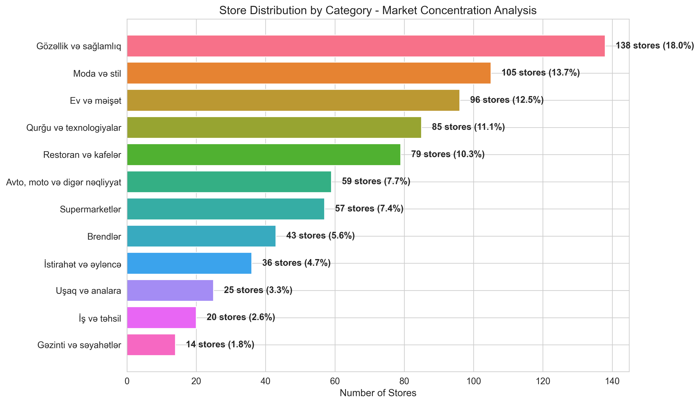

**What This Shows:**
The marketplace exhibits clear category concentration with Beauty & Health leading at 18%, followed by Fashion (13.7%) and Home & Lifestyle (12.5%). The top three categories control 44% of total platform inventory.

**Business Impact:**
- **Market Positioning**: Platform demonstrates strength in lifestyle and consumer-focused verticals
- **Diversification Opportunity**: Underrepresented categories (Travel, Education, Children's products) present expansion opportunities
- **Competitive Dynamics**: High concentration in top categories may indicate either market strength or oversaturation risk

**Strategic Implications:**
- Consider targeted merchant recruitment in underrepresented categories
- Evaluate whether top categories face margin pressure from oversupply
- Assess customer demand patterns to validate category balance

---

### 2. Cashback Incentive Strategy Distribution

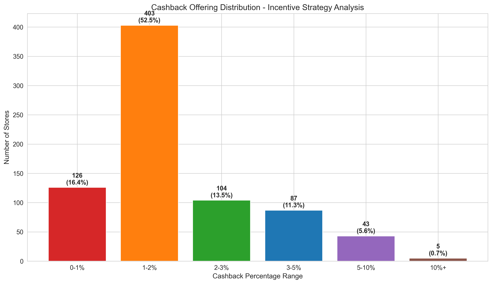

**What This Shows:**
Nearly half of all stores (48.7%) offer exactly 2% cashback. The distribution shows a standard offering at 2%, with strategic differentiation at 3% (13.2%) and 5% (7.0%), while 48 stores (6.3%) offer premium cashbacks exceeding 5%.

**Business Impact:**
- **Price Anchoring**: The 2% standard creates a baseline customer expectation
- **Competitive Differentiation**: Limited use of premium cashback (>5%) suggests underexploited competitive lever
- **Cost Structure**: 24 stores offering 0% cashback may face competitive disadvantage or operate in unique niches

**Strategic Implications:**
- Test whether increasing cashback rates drives measurable customer acquisition
- Identify if premium cashback stores achieve higher conversion or loyalty
- Consider dynamic cashback recommendations based on category and competition

---

### 3. Category-Specific Cashback Competitive Landscape

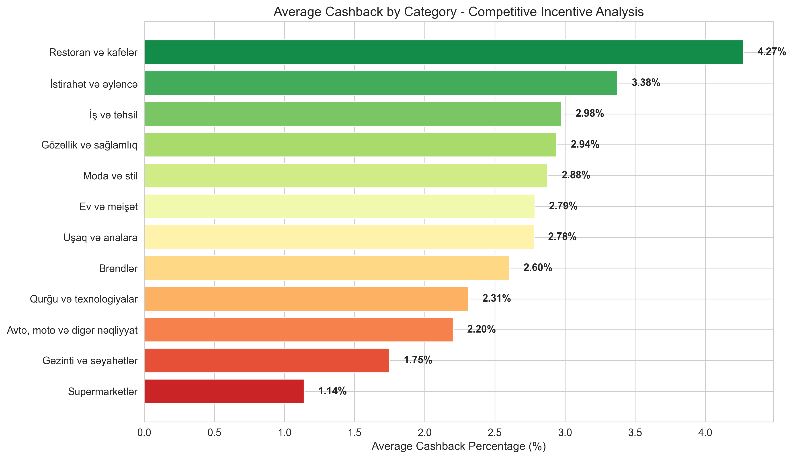

**What This Shows:**
Restaurants & Cafes lead cashback offerings at 4.27% average, followed by Entertainment (3.38%) and Education (2.98%). Technology and automotive categories lag at approximately 2.3%.

**Business Impact:**
- **Category Economics**: Higher cashback in restaurants suggests either higher margins or more aggressive customer acquisition strategies
- **Value Perception**: Lower cashback in technology may reflect thin margins or brand-driven demand
- **Competitive Intensity**: Cashback variation indicates different competitive dynamics across categories

**Strategic Implications:**
- Guide merchants in underperforming categories to optimize cashback for competitiveness
- Analyze whether category-specific cashback drives differentiated customer behavior
- Consider platform-subsidized promotions in strategic categories

---

### 4. Digital Communication Channel Gap Analysis

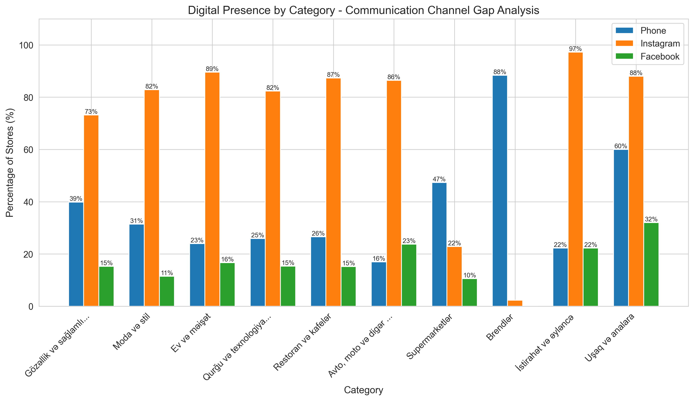

**What This Shows:**
Instagram dominates social presence (70%+ in most categories), while phone contact information is inconsistently provided (ranging from 17% in automotive to 88% in brands). Facebook adoption is universally low (<20% except supermarkets).

**Business Impact:**
- **Customer Access Barrier**: Missing phone numbers in 65% of stores creates friction in customer service
- **Channel Preference Mismatch**: High Instagram usage suggests visual-first marketing, but may exclude phone-preference customers
- **Trust and Credibility**: Incomplete contact information may reduce customer confidence

**Strategic Implications:**
- Mandate phone number collection during merchant onboarding
- Develop Instagram-integrated customer communication tools
- Analyze correlation between contact availability and conversion rates

---

### 5. Customer Rating Participation Crisis

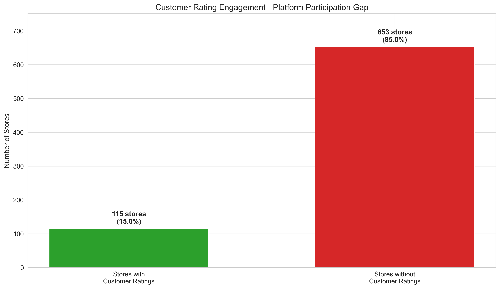

**What This Shows:**
Only 115 stores (15%) have customer ratings, while 653 stores (85%) operate without any customer feedback.

**Business Impact:**
- **Trust Deficit**: Absence of ratings creates information asymmetry, potentially suppressing conversions
- **Competitive Disadvantage**: Stores without ratings cannot differentiate on service quality
- **Platform Credibility**: Low rating participation may indicate broader customer engagement issues

**Strategic Implications:**
- **Immediate Action Required**: Implement aggressive rating collection campaigns
- Investigate root causes: Are customers not prompted? Are merchants discouraging reviews?
- Consider incentive programs: reward customers for verified reviews
- Make rating collection a core merchant success metric

---

### 6. Category-Level Rating Engagement Performance

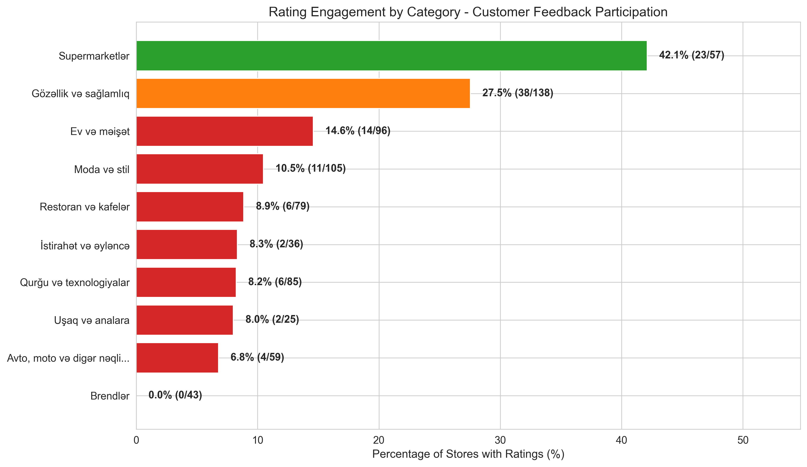

**What This Shows:**
Supermarkets lead rating participation at 42%, while Brands show 0% engagement. Beauty & Health achieves 27.5%, while most other categories languish below 15%.

**Business Impact:**
- **Best Practice Identification**: Supermarkets demonstrate that high rating engagement is achievable
- **Category-Specific Barriers**: Brand merchants may rely on external reputation rather than platform reviews
- **Opportunity Gap**: Fashion, Technology, and Restaurant categories show particularly low engagement despite high store counts

**Strategic Implications:**
- Study supermarket rating success factors for replication across platform
- Develop category-specific rating collection strategies
- Consider mandatory rating prompts after verified purchases
- Prioritize Fashion and Technology for rating engagement pilots (large opportunity)

---

### 7. Customer Satisfaction Quality Assessment

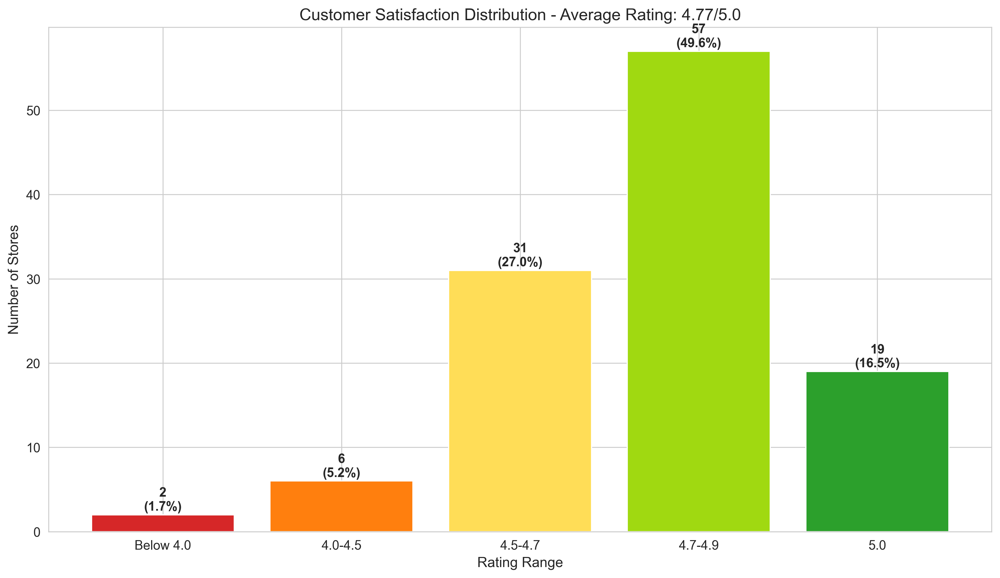

**What This Shows:**
Among stores with ratings, satisfaction is exceptionally high: 76% score 4.7-5.0, with an overall average of 4.77/5.0. Only 3 stores score below 4.5.

**Business Impact:**
- **Service Quality Validation**: High ratings confirm platform merchants deliver quality experiences
- **Competitive Strength**: 4.77 average positions platform favorably against industry benchmarks
- **Hidden Risk**: Small sample size (only 15% rated) may not represent full merchant base

**Strategic Implications:**
- Leverage high satisfaction scores in marketing and merchant recruitment
- Use quality ratings as merchant vetting tool during onboarding
- Investigate if unrated stores perform worse (explaining why they avoid ratings)
- Establish minimum rating thresholds for featured merchant status

---

### 8. Store Expansion Model and Multi-Location Analysis

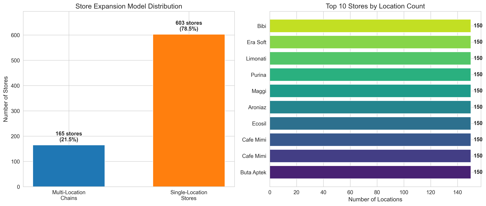

**What This Shows:**
165 stores (21.5%) operate multiple locations, while 603 stores (78.5%) remain single-location. The top 10 multi-location chains each operate 150 locations, dominated by major brands (Buta Aptek, Cafe Mimi, etc.).

**Business Impact:**
- **Scalability Proven**: Multi-location model is viable and successful for certain business types
- **Growth Potential**: 78.5% single-location base represents significant expansion opportunity
- **Platform Network Effects**: Large chains (150 locations) demonstrate platform can support enterprise-scale operations

**Strategic Implications:**
- Develop merchant expansion programs to help single-location stores scale
- Analyze characteristics of successful multi-location merchants for replication
- Create tiered service offerings: single-location vs. enterprise chain management
- Consider geographic expansion support for high-performing single-location stores

---

### 9. Cashback Strategy and Competitive Positioning

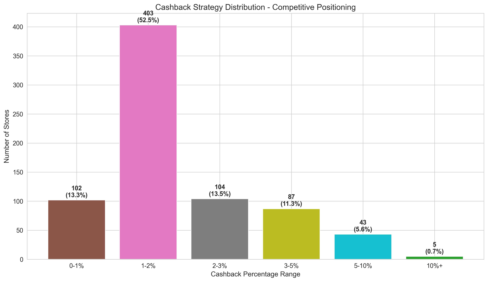

**What This Shows:**
The cashback landscape is tiered: 48.7% at 2%, 13.2% at 2-3%, 10.5% at 3-5%, 6.3% at 5-10%, and only 0.5% offering 10%+. The 1-2% range (aggregating 0-1% and 1-2%) represents 65% of the platform.

**Business Impact:**
- **Competitive Clustering**: Heavy concentration at 2% creates commoditization risk
- **Differentiation Limited**: Only 6.8% of stores use premium cashback (>5%) as differentiator
- **Revenue Sharing Model**: Low cashback rates may indicate merchant margin constraints or conservative strategy

**Strategic Implications:**
- Test market responsiveness to cashback variations through controlled experiments
- Develop cashback recommendation engine based on category, competition, and merchant margins
- Consider platform-matched cashback campaigns to drive trial in strategic categories
- Analyze whether premium cashback drives measurable loyalty or primarily attracts deal-seekers

---

### 10. Category Market Share and Strategic Opportunity Mapping

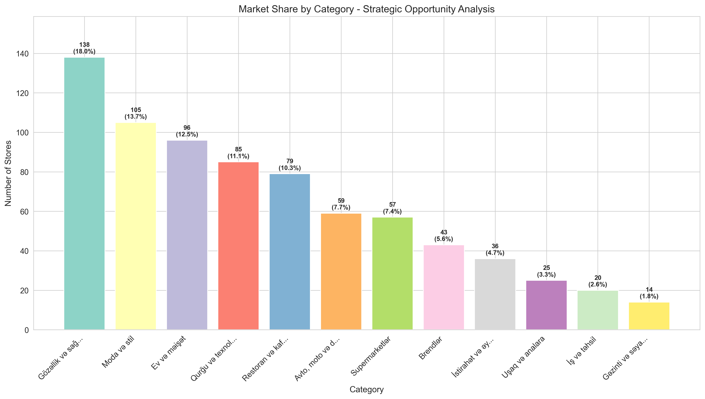

**What This Shows:**
Beauty & Health dominates with 18% market share, followed by Fashion (13.7%), Home (12.5%), Technology (11.1%), and Restaurants (10.3%). The top 5 categories control 65.6% of platform inventory.

**Business Impact:**
- **Platform Identity**: Strong presence in lifestyle categories positions platform as consumer-lifestyle marketplace
- **Category Balance Risk**: Over-reliance on top categories creates vulnerability to category-specific downturns
- **White Space Opportunity**: Travel (14 stores), Education (20 stores), and Children's products (25 stores) are significantly underdeveloped

**Strategic Implications:**
- Maintain leadership in core categories while pursuing strategic diversification
- Launch targeted merchant recruitment in underrepresented categories
- Assess customer demand for underrepresented categories before major investment
- Consider category-specific marketing campaigns to drive awareness in underdeveloped areas

---

### 11. Digital Strategy Sophistication by Store Scale

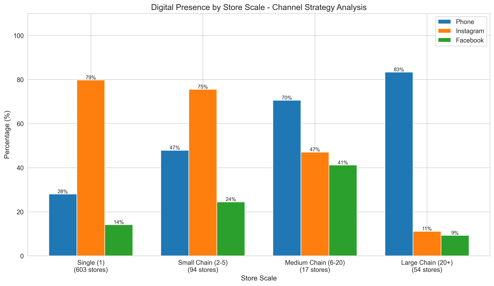

**What This Shows:**
Large chains (20+ locations) show 75% phone availability but only 20% Instagram presence. Conversely, single-location stores show 30% phone availability but 75% Instagram presence. Medium chains (6-20 locations) balance both channels at ~50% each.

**Business Impact:**
- **Channel Strategy Divergence**: Small stores rely on social media; large chains on traditional contact
- **Sophistication Gap**: Store scale correlates with digital strategy maturity and channel diversification
- **Best Practice Model**: Medium chains demonstrate balanced omnichannel approach

**Strategic Implications:**
- Provide digital strategy guidance tailored to store scale and resources
- Help single-location stores add professional phone contact systems
- Encourage large chains to adopt social media for customer engagement and marketing
- Develop platform tools that reduce barriers to omnichannel presence

---

### 12. Rating Performance and Engagement Priority Analysis

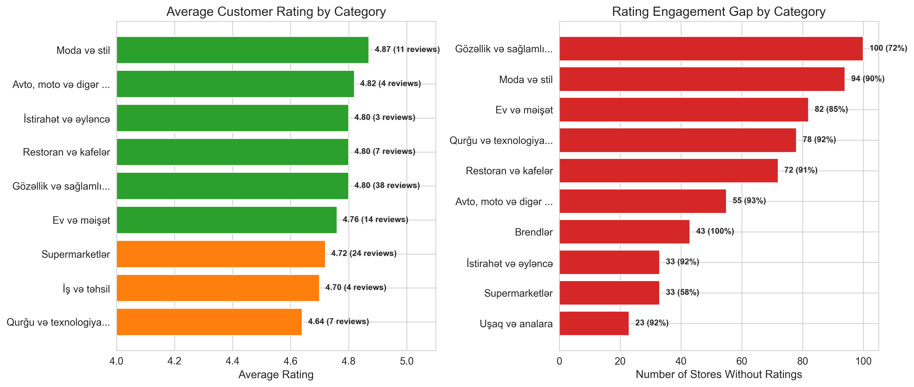

**What This Shows:**
**Left Panel**: Categories with sufficient ratings show consistent high quality (4.5-4.9 average), with Restaurants, Beauty, and Entertainment leading.

**Right Panel**: Beauty & Health has 100 unrated stores (73% of category), Fashion has 94 unrated (90%), and Home has 82 unrated (85%).

**Business Impact:**
- **Quality Consistency**: High ratings across categories validate platform merchant quality
- **Massive Engagement Gap**: Hundreds of stores in major categories lack any customer feedback
- **Competitive Disadvantage**: Unrated stores cannot compete effectively against rated peers

**Strategic Implications:**
- **Priority Action**: Launch category-specific rating campaigns starting with Beauty, Fashion, and Home
- Implement post-purchase rating prompts with time-limited incentives
- Require minimum ratings threshold for premium placement in search results
- Develop merchant education: help them understand rating importance and best practices for collection

---

## Strategic Recommendations for Platform Leadership

### Immediate Actions (Next 30 Days)

1. **Launch Rating Collection Campaign**
   - Implement automated post-purchase rating requests
   - Offer small incentives (bonus cashback points) for verified reviews
   - Set target: Increase rating participation from 15% to 30% within 90 days

2. **Mandate Complete Merchant Profiles**
   - Require phone numbers for all new merchant onboarding
   - Conduct outreach campaign to fill existing contact information gaps
   - Target: 80% phone availability within 60 days

3. **Analyze High-Cashback Performance**
   - Conduct deep-dive study of 48 stores offering >5% cashback
   - Measure conversion rates, customer lifetime value, and profitability
   - Use findings to develop cashback optimization recommendations

### Short-Term Initiatives (Next 90 Days)

4. **Develop Category-Specific Growth Strategies**
   - Recruit merchants in underrepresented categories (Travel, Education, Children's)
   - Create category landing pages highlighting available inventory
   - Launch targeted marketing campaigns to drive category awareness

5. **Implement Merchant Expansion Support Program**
   - Identify high-performing single-location stores with expansion potential
   - Provide resources: location analysis, operational support, marketing assistance
   - Set target: Help 50 single-location stores open second locations within 12 months

6. **Create Omnichannel Presence Incentives**
   - Reward merchants who maintain complete profiles (phone + social + website)
   - Provide digital strategy consultation for single-location stores
   - Develop platform-integrated tools for Instagram and Facebook commerce

### Long-Term Strategic Priorities (Next 6-12 Months)

7. **Geographic Expansion Beyond Baku**
   - Assess merchant interest in expanding to other Azerbaijani cities
   - Develop infrastructure to support multi-city operations
   - Launch pilot programs in 2-3 secondary cities

8. **Build Data-Driven Cashback Recommendation Engine**
   - Develop algorithm that suggests optimal cashback based on category, competition, margins
   - Test dynamic cashback (varying by time, customer segment, inventory levels)
   - Measure impact on merchant revenue and platform transaction volume

9. **Establish Merchant Quality and Growth Tiers**
   - Create tiered merchant program: Bronze (basic listing) → Silver (complete profile + ratings) → Gold (high ratings + multi-location) → Platinum (enterprise chains)
   - Provide tier-specific benefits: search prominence, marketing support, lower fees
   - Use tiers to drive merchant behavior toward platform best practices

---

## Risk Mitigation Priorities

### High-Risk Areas Requiring Attention

1. **Rating System Underutilization**
   - **Risk**: Customers cannot differentiate quality; poor merchants cannot be identified
   - **Mitigation**: Aggressive rating collection + merchant education + search algorithm changes

2. **Geographic Concentration**
   - **Risk**: Platform vulnerable to Baku-specific economic or competitive shocks
   - **Mitigation**: Develop multi-city expansion roadmap with merchant support programs

3. **Digital Presence Gaps**
   - **Risk**: Customers frustrated by inability to contact merchants; lost sales
   - **Mitigation**: Mandatory contact information + platform communication tools

4. **Category Imbalance**
   - **Risk**: Over-reliance on Beauty, Fashion, Home creates category-specific vulnerability
   - **Mitigation**: Strategic recruitment in underrepresented categories

---

## Competitive Positioning and Market Opportunity

### Platform Strengths to Leverage

- **High Merchant Satisfaction**: 4.77/5.0 rating demonstrates quality merchant experience
- **Scale in Core Categories**: Market leadership in Beauty, Fashion, Home provides negotiating power
- **Multi-Location Success Stories**: Proven ability to support large-scale chain operations
- **Cashback Differentiation**: Flexible incentive structure allows competitive positioning

### Competitive Vulnerabilities to Address

- **Trust Deficit**: 85% of stores without ratings creates information gap vs. competitors
- **Geographic Limitation**: Baku-only presence limits market size and growth potential
- **Digital Immaturity**: Inconsistent contact information and social presence reduces customer confidence
- **Commoditized Cashback**: Heavy concentration at 2% limits differentiation

---

## Conclusion

The Umico/Birmarket platform demonstrates strong fundamentals: high customer satisfaction, diverse merchant base, and proven scalability for multi-location operations. However, critical operational gaps in rating engagement, digital presence, and geographic diversification present both immediate challenges and significant growth opportunities.

**The most urgent priority is addressing the rating participation crisis.** With 85% of stores unrated, the platform lacks the trust signals necessary for optimal customer decision-making and merchant differentiation. Implementing aggressive rating collection mechanisms will unlock competitive advantages across the entire platform.

**The greatest growth opportunity lies in merchant expansion support.** With 78.5% of stores operating single locations while successful chains demonstrate 150-location viability, helping merchants scale represents a massive revenue multiplier for the platform.

By executing the recommended strategic initiatives, platform leadership can transform operational gaps into competitive advantages, driving merchant growth, customer satisfaction, and platform market share.

---

## Appendix: Data Overview

- **Total Stores Analyzed**: 768
- **Data Collection Date**: December 2025
- **Geographic Coverage**: Baku, Azerbaijan
- **Categories Analyzed**: 12 major categories
- **Key Metrics Evaluated**: Cashback rates, customer ratings, digital presence, location counts, category distribution

---

*This analysis is based on comprehensive data from the Umico/Birmarket marketplace platform and is intended for strategic decision-making by platform leadership, merchant success teams, and business development stakeholders.*
